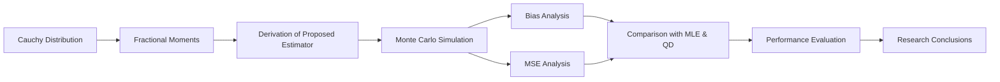

<p align="center">

</p>

<h1 align="center">
📊 Estimation of Scale Parameter for the Cauchy Distribution
</h1>

<h3 align="center">
A Fractional Moment-Based Approach
</h3>

<p align="center">

<b>DST Approved Research Internship Project</b><br>

Department of Science and Technology (DST), Government of India

<br><br>

Agricultural and Ecological Research Unit (AERU)<br>

Indian Statistical Institute (ISI), Kolkata

</p>


<p align="center">


</p>

---

# 🌟 Project Highlights

- 🔹 Proposed a **Novel Fractional Moment-Based Estimator** for the Cauchy Scale Parameter.
- 🔹 Developed a statistically robust estimation approach for **Heavy-Tailed Distributions**.
- 🔹 Conducted an extensive **Monte Carlo Simulation Study**.
- 🔹 Compared the proposed estimator with **Maximum Likelihood Estimation (MLE)** and **Quartile Deviation (QD)**.
- 🔹 Evaluated estimator performance using **Bias** and **Mean Squared Error (MSE)**.
- 🔹 Entire implementation carried out in **R Programming**.
- 🔹 Research Internship supported by the **Department of Science and Technology (DST), Government of India**.

---

# 📖 Project Overview

This repository presents a **DST Approved Research Internship Project** carried out at the **Agricultural and Ecological Research Unit (AERU), Indian Statistical Institute (ISI), Kolkata**.

The **Cauchy distribution** is a well-known heavy-tailed probability distribution whose mean and variance are undefined. Consequently, conventional moment-based estimation methods fail for parameter estimation.

To address this challenge, this work proposes a **fractional moment-based estimator** for estimating the **scale parameter** of the Cauchy distribution. By exploiting finite fractional moments, the proposed approach provides a robust and efficient alternative for parameter estimation.

The estimator is validated through extensive Monte Carlo simulation studies and compared with well-established classical estimators including **Maximum Likelihood Estimation (MLE)** and **Quartile Deviation (QD)**.

---

# 🎯 Objectives

- Study the statistical challenges associated with the Cauchy distribution.
- Develop a fractional moment-based estimator for the scale parameter.
- Investigate the limiting behaviour as **α → 0**.
- Compare the proposed estimator with classical estimation methods.
- Evaluate estimator performance through Monte Carlo simulations.
- Analyse statistical efficiency using Bias and Mean Squared Error (MSE).

---

# 🧮 Mathematical Background

For

```math
X \sim C(\mu,\sigma),
```

the probability density function is

```math
f(x;\mu,\sigma)=
\frac{1}{\pi\sigma}
\frac{1}
{1+\left(\frac{x-\mu}{\sigma}\right)^2},
\qquad x\in\mathbb{R}.
```

Although the Cauchy distribution has **no finite mean or variance**, the fractional moments

```math
E|X-\mu|^{\alpha},
\qquad -1<\alpha<1,
```

exist and form the theoretical foundation of the proposed estimator.

---

# 🔬 Research Workflow



---

# ⚙️ Simulation Configuration

| Parameter | Value |
|-----------|:------:|
| Sample Size | **n = 14** |
| Number of Simulations | **1000** |
| Location Parameter | **μ = 5** |
| Scale Parameter | **σ = 2** |
| Fractional Order | **−0.99 ≤ α ≤ 0.99** |

---

# 📈 Proposed Estimator

The proposed estimator for the scale parameter is defined as

```math
\hat{\sigma}_{\alpha}
=
\left(
\frac{1}{g(\alpha)n}
\sum_{i=1}^{n}
|X_i-\mu|^{\alpha}
\right)^{1/\alpha},
\qquad
\alpha\in(-1,0)\cup(0,1),
```

where

```math
g(\alpha)
=
\frac{
\Gamma\left(\frac{1+\alpha}{2}\right)
\Gamma\left(\frac{1-\alpha}{2}\right)
}{\pi}
=
\frac{1}{\cos(\alpha\pi/2)}.
```

As

```math
\alpha \rightarrow 0,
```

the estimator converges to the **geometric mean estimator**, establishing a natural link between fractional moment estimation and robust statistical estimation.

---

# 📊 Performance Evaluation

The proposed estimator was compared with two widely used classical estimators through extensive Monte Carlo simulations.

### Compared Estimators

- 📌 Maximum Likelihood Estimator (MLE)
- 📌 Quartile Deviation (QD)
- 📌 Proposed Fractional Moment Estimator

### Performance Criteria

- **Bias**

```math
Bias(\hat{\sigma})=E(\hat{\sigma})-\sigma
```

- **Mean Squared Error (MSE)**

```math
MSE(\hat{\sigma})
=
E[(\hat{\sigma}-\sigma)^2]
```

---

# 🏆 Key Findings

The proposed estimator demonstrates:

- ✅ Lower bias for appropriate choices of **α**
- ✅ Lower Mean Squared Error in several simulation settings
- ✅ Strong robustness against heavy-tailed observations
- ✅ Competitive performance compared with Maximum Likelihood Estimation
- ✅ Improved efficiency over the Quartile Deviation estimator
- ✅ Smooth convergence to the geometric mean estimator as **α → 0**

---

# 📊 Repository Contents

The repository includes:

- 📘 Complete Research Report
- 📄 Internship Completion Certificate
- 💻 Fully Documented R Source Code
- 📈 Monte Carlo Simulation Results
- 📊 Bias and MSE Analysis
- 📉 Comparative Performance Study
- 📚 Project Documentation

---

# 🛠 Software & Technologies

| Category | Tools |
|----------|-------|
| Programming Language | **R** |
| Statistical Packages | psych, cauchypca, graphics |
| Documentation | LaTeX (Overleaf) |
| Statistical Methods | Fractional Moments, Monte Carlo Simulation, Robust Estimation |

---

# 📂 Repository Structure

```text
📦 Estimation-of-Scale-Parameter-for-Cauchy-Distribution
│
├── 📄 Certificate.pdf
├── 📘 Final Report.pdf
├── 📊 Internship_new.R
├── 📜 LICENSE
└── 📖 README.md
```

---

# 🔬 Research Contribution

This project proposes a **fractional moment-based estimator** for estimating the scale parameter of the Cauchy distribution, addressing one of the fundamental challenges posed by heavy-tailed distributions where conventional moment-based techniques are not applicable.

The estimator was theoretically derived and validated through comprehensive Monte Carlo simulation studies, with its statistical performance evaluated using **Bias** and **Mean Squared Error (MSE)**. The study demonstrates that fractional moments provide an effective framework for robust parameter estimation.

---

# 🚀 Future Scope

Potential directions for future work include:

- Extension to multivariate Cauchy distributions.
- Generalization to other heavy-tailed probability distributions.
- Robust statistical modelling for financial data.
- Applications in environmental and ecological statistics.
- Bayesian estimation for heavy-tailed models.
- Integration with modern machine learning techniques.

---

# 👨‍💻 Author

## Debapriyo Bhar

**B.Sc. Major in Statistics**

Ramakrishna Mission Residential College (Autonomous), Narendrapur

📧 **Email:**  
debapriyobhar@gmail.com

💼 **LinkedIn:**  
https://www.linkedin.com/in/debapriyo-bhar-5074a6303

---

# 🎓 Research Supervisor

## Prof. Sabyasachi Bhattacharya

Professor

**Agricultural and Ecological Research Unit (AERU)**

Indian Statistical Institute (ISI), Kolkata

---

# 🙏 Acknowledgements

This research was carried out during a **Research Internship at the Agricultural and Ecological Research Unit (AERU), Indian Statistical Institute (ISI), Kolkata**, under the support of the **Department of Science and Technology (DST), Government of India**.

I sincerely express my heartfelt gratitude to **Prof. Sabyasachi Bhattacharya** for his invaluable guidance, encouragement, and continuous support throughout this research. His mentorship greatly contributed to the successful completion of this work.

I also thank the **Agricultural and Ecological Research Unit (AERU), Indian Statistical Institute (ISI), Kolkata**, for providing an inspiring research environment and the necessary academic resources.

---

# ⭐ If you found this repository useful...

<p align="center">

⭐ Star this repository

🍴 Fork it

📢 Share it with fellow researchers

</p>

---

<p align="center">

</p>

<p align="center">
<b>Made with ❤️ using R, Statistics and Research.</b>
</p>
